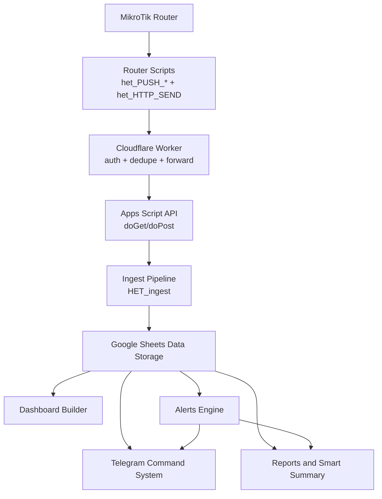

# het system architecture blueprint

version: 2026-03-10
scope: het monitoring platform ka end-to-end logical aur operational architecture

## 1) architecture objective

is blueprint ka maqsad yeh hai ke koi bhi engineer quickly samajh sake ke het monitoring platform me data kahan se aata hai, kis layer se guzarta hai, kahan store hota hai, aur kis tarah dashboard, alerts, telegram, aur reports tak pohanchta hai.

## 2) end-to-end logical flow

1. MikroTik Router runtime stats aur events generate karta hai.
2. Router scripts in stats ko typed payload me convert karti hain.
3. Cloudflare Worker request token validate karta hai, dedupe apply karta hai, aur request ko Apps Script API ko forward karta hai.
4. Apps Script `doGet`/`doPost` layer request receive karke ingest pipeline ko route karti hai.
5. Ingest layer payload `type` ke mutabiq Google Sheets ke target tabs me row append karti hai.
6. Dashboard builder latest sheet data se snapshot banata hai aur dashboard render karta hai.
7. Alerts engine thresholds, stale windows, aur log severity ke basis par alerts generate karta hai.
8. Telegram command system same snapshot/alerts data ko command response me use karta hai.
9. Reports aur smart summary daily ya command-driven output generate karte hain.

## 3) component-by-component explanation (Roman Urdu)

### 3.1 router se data kaise collect hota hai
- router ke interface counters, cpu, memory, uptime, vpn state, dhcp users, aur logs runtime me available hote hain.
- `het_PUSH_*` scripts periodic schedule par yeh metrics read karti hain.
- har script ek specific payload type banati hai jese `live`, `traffic`, `vpn`, `users`, `usage`, `routerlog`, `change`.

### 3.2 router scripts ka role
- `het_CONFIG`: endpoint/token/site/router globals set karta hai.
- `het_HTTP_SEND`: common transport wrapper hai jo payload worker ko bhejta hai.
- `het_PUSH_*`: domain-specific collectors hain (live/traffic/vpn/users/usage/log/change).
- scheduler orchestration ensure karti hai ke har stream apne interval par publish hoti rahe.

### 3.3 worker kis purpose ke liye use ho raha hai
- router aur Apps Script ke darmiyan controlled gateway provide karta hai.
- token-based auth guard se unauthorized requests block hoti hain.
- dedupe short burst repeat payload ko filter karta hai.
- upstream response ko normalize karke diagnostics easier banata hai.

### 3.4 worker ka authentication aur forwarding logic
- token sources: `payload.token`, `payload.t`, ya `X-Token` header.
- expected secret: `ROUTER_TOKEN` env binding.
- mismatch par worker `401 AUTH_FAIL` return karta hai.
- valid request ko `APPS_SCRIPT_URL` par form-urlencoded format me forward kiya jata hai.
- response wrapper me `ok`, `status`, aur `upstream` fields milti hain.

### 3.5 Apps Script ingest pipeline kaise kaam karta hai
- entry points: `doGet(e)` aur `doPost(e)`.
- auth + admin routes evaluate hote hain (`admin=status`, `admin=setup`, etc.).
- monitor payload `HET_ingest` me route hota hai.
- `type` switch ke mutabiq correct sheet selected hoti hai.
- accepted payload ka raw audit trace bhi maintain hota hai (`RAW Live`/`RAW Events`).

### 3.6 data Google Sheets me kaise store hota hai
- each payload type ka dedicated operational sheet hai.
- append model use hota hai taa ke historical timeline preserve rahe.
- dashboard/alerts/reports same source sheets par depend karte hain.
- sheet freshness monitoring se stale streams identify hoti hain.

### 3.7 dashboard kaise build hota hai
- `HET_collectSnapshot_()` latest rows se normalized runtime snapshot banata hai.
- dashboard renderer KPIs, traffic, alerts, users, aur health blocks update karta hai.
- traffic activity labels running-state aware logic par based hain (`Active`, `No recent traffic`, `Not connected`, etc.).

### 3.8 alerts kaise generate hote hain
- live stream thresholds (cpu/memory) evaluate hoti hain.
- stale windows (`live` aur `traffic`) periodic cycle me check hoti hain.
- vpn down aur router log severity based conditions detect hoti hain.
- cooldown controls duplicate noisy alert se bachate hain.

### 3.9 telegram commands kaise operate karte hain
- polling cycle new updates pull karta hai.
- auth checks ke baad command parser handler route karta hai.
- command responses sheet-backed snapshot se ban kar return hoti hain.
- `/health`, `/traffic`, `/alerts`, `/users`, `/report`, `/tgdebug` operations diagnostics aur NOC workflows support karte hain.

## 4) data flow matrix

| stage | input | process | output | next dependency |
|---|---|---|---|---|
| router runtime | interface/vpn/system/log stats | metric read | raw runtime values | router scripts |
| router scripts | runtime values | typed payload build | form payload | worker |
| worker | router payload + token | auth + dedupe + forward | proxied request | apps script api |
| apps script api | forwarded request | parse + route + ingest | sheet rows + status | google sheets |
| sheet storage | append rows | historical persistence | latest + history | dashboard/alerts/telegram/reports |
| dashboard builder | sheet latest rows | snapshot + layout build | dashboard blocks | ops viewers |
| alerts engine | snapshot + stale windows | rules evaluation | alerts rows/outbox | telegram/email |
| telegram system | user command/update | command handler | reply message | chat ops |
| reports/smart summary | daily cycle + snapshots | aggregation | summary report | telegram/email/sheet logs |

## 5) dependency map

| component | depends on | dependency type | failure impact |
|---|---|---|---|
| router scripts | `het_CONFIG`, `het_HTTP_SEND`, scheduler | runtime config + transport | payload publish stop |
| worker | `ROUTER_TOKEN`, `APPS_SCRIPT_URL`, internet | auth + upstream routing | ingest chain break |
| apps script api | script properties + sheet ids | processing + persistence | no sheet updates |
| google sheets | apps script writes | state storage | dashboard/alerts stale |
| dashboard | `Router Status`, `Raw_Traffic_Log`, `VPN Status`, `Alerts`, `Connected Users` | read model | wrong or stale UI |
| alerts | live/traffic/log sheets + config thresholds | rules engine | missed incidents |
| telegram commands | polling cycle + snapshot functions | command execution | no bot response |
| reports/smart summary | daily trigger + sheet data | aggregation | daily reporting fail |

## 6) visual architecture diagram (Mermaid)

## 7) operational trust boundaries

1. boundary-1: router network se internet edge tak (transport reliability).
2. boundary-2: worker auth boundary (token validation mandatory).
3. boundary-3: apps script authorization + ingest safety.
4. boundary-4: sheet data integrity (write schema consistency).
5. boundary-5: user-facing channels (dashboard/telegram/report output).

## 8) architecture validation checklist

1. router se manual payload send success (`het_PUSH_LIVE`) verify ho.
2. worker response me `ok=true` aur upstream success mile.
3. `admin=status` me key sheets fresh nazar ayen.
4. dashboard me traffic + live + vpn values recent hon.
5. telegram `/health` command expected reply de.
6. daily report cycle expected schedule par run kare.

## 9) cross references

- handbook: `docs/het-knowledge-base/01-het-operational-handbook.md`
- source inventory: `docs/het-knowledge-base/05-source-inventory.md`
- deployment: `docs/het-knowledge-base/10-full-deployment-guide.md`
- disaster recovery: `docs/het-knowledge-base/09-disaster-recovery-playbook.md`
